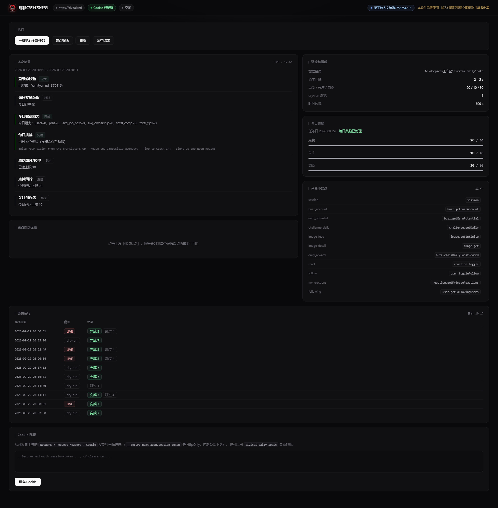
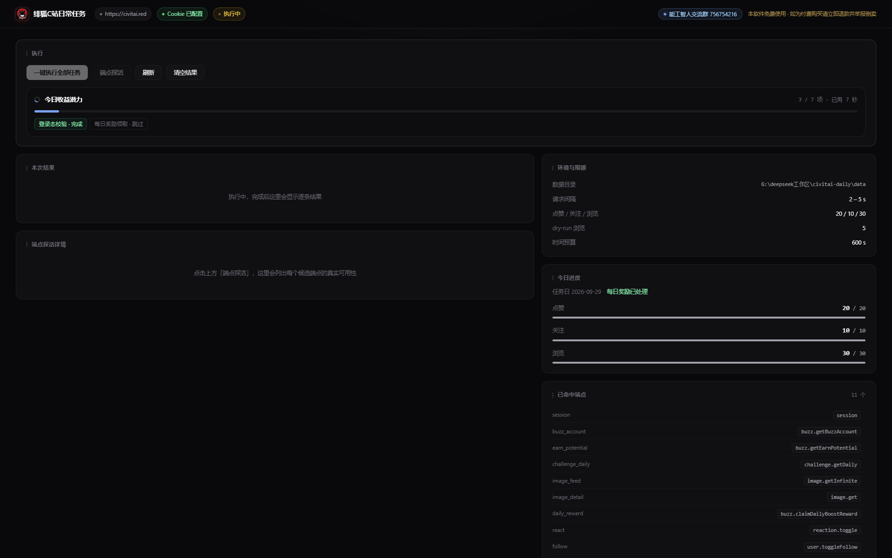
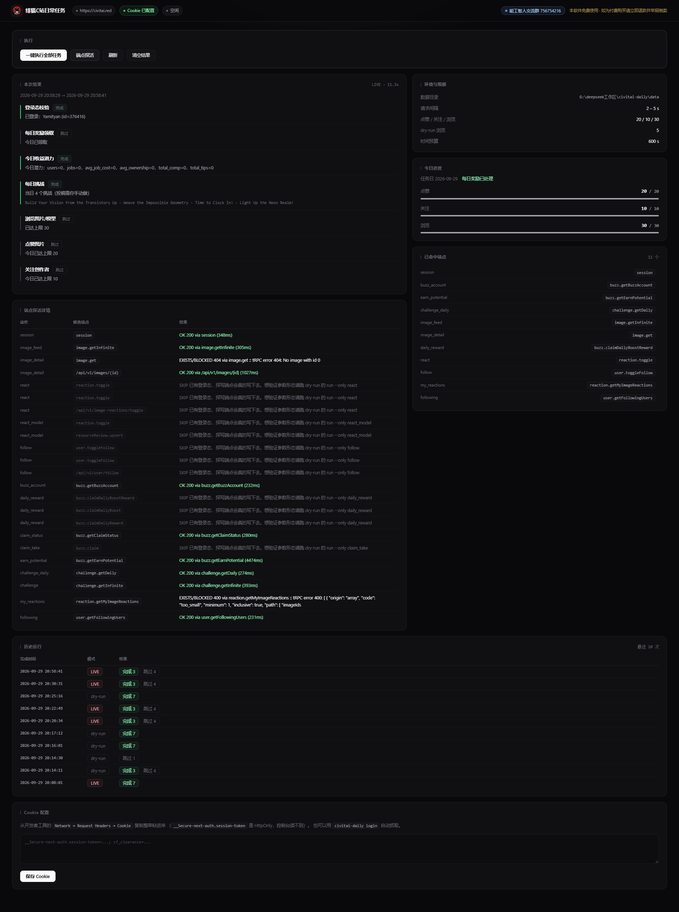

# 绯狐C站日常任务

给 [civitai.red](https://civitai.red)（Civitai 官方备用主域名，与 civitai.com 后端同源）做的一键每日任务执行器。形态是 **Python CLI + Web 管理面板**：单账号视图，把 Buzz 活跃度这块做全自动。

包名与命令名保持 `civitai_daily` / `civitai-daily`（换掉会破坏已安装的入口点），界面与文档统一显示为「绯狐C站日常任务」。

一句话：`civitai-daily run --live` 把当天能自动化的免费 Buzz 收益跑完，跑不动的项目如实列出来告诉你为什么。

---

## 先说清楚一个前提

Civitai 没有「签到」这个按钮。免费 Buzz 叫 **Blue Buzz**，来源有三块，本项目对每一块都做了实测：

1. `buzz.claimDailyBoostReward` —— 每日 Boost 领取，**无参 mutation**，这是最接近传统签到的东西。
2. **站内活跃度** —— 点赞、浏览、关注，靠真实行为累积，官方进度可用 `buzz.getEarnPotential` 读。
3. `challenge.getDaily` —— 每日挑战，**匿名就能读到**当日主题。

所以工具的执行顺序是：先领（1）→ 读官方任务进度（2 的报表）→ 列当日挑战（3）→ 再用点赞/浏览/关注把活跃度补上。

顺带澄清一个常见误解：`user.getUserReward`、`buzz.claimDailyReward` 这类看起来"应该存在"的
签到端点，实测全部返回 `No procedure found on path` —— **站点确实没有签到接口**。
工具会如实报「不存在」，而不是编一个成功出来。

---

## 快速开始

```bash
cd civitai-daily
pip install -r requirements.txt
python -m civitai_daily.cli init          # 生成 data/config.yaml
python -m civitai_daily.cli login         # 打开浏览器登录，自动抓 Cookie（详见下节）

python -m civitai_daily.cli run           # dry-run：只校验，不改动任何站点状态
python -m civitai_daily.cli run --live    # 真正执行领取 / 点赞 / 关注
python -m civitai_daily.cli serve         # 起 Web 面板 http://127.0.0.1:8787
```

装成命令后可以直接 `civitai-daily run --live`。

---

## 怎么拿 Cookie

三条路，按省事程度排。

### A. 自动抓（推荐）

```bash
pip install "civitai-daily[browser]"
civitai-daily login
```

会弹出一个真实的 Chrome 窗口（**复用系统已装的 Chrome / Edge，不需要 `playwright install chromium`**），
你正常登录就行。工具每 1.5 秒探一次 session cookie，检测到就自动收工落盘，
然后立刻调 `/api/auth/session` 校验一遍并打印你的用户名。不用按任何键，最长等 300 秒（`--timeout` 可调）。

实测：系统 Chrome 通道能正常起，且能直接加载 civitai.red 的真实页面 ——
**Cloudflare 拦的是裸 HTTP 请求，真实浏览器内核（哪怕是 headless）能过**。

### B. 手动复制（不想装 playwright 时）

关键点：**`__Secure-next-auth.session-token` 是 HttpOnly 的，`document.cookie` 里读不到。**
别在 Console 里敲 `copy(document.cookie)`，那只能拿到 `_ga` 之类的垃圾。

走请求头：

1. 浏览器打开 https://civitai.red，确认已登录（右上角有头像）
2. `F12` → 切到 **Network / 网络** 标签
3. `F5` 刷新页面
4. 点列表里第一条发往 `civitai.red` 的请求
5. 右侧 **Headers → Request Headers**，找到 `Cookie:` 那一行
6. 右键 → **Copy value**（或直接选中整行复制）
7. 粘进 `data/cookies.txt`，或粘到面板的 Cookie 框里点保存

懒人版：右键请求 → **Copy → Copy as cURL (bash)**，从结果里抠出 `-H 'Cookie: xxxxx'` 引号里那段，效果一样。

### C. 从面板粘贴

`civitai-daily serve` → 打开面板 → 最下面「Cookie 配置」贴进去 → 保存。立即生效，不用重启。

### 几个必踩的坑

- **把 `cf_clearance` 一起带上。** 那是 Cloudflare 的通行证，只带 session token 有时会被当成机器人。
  从请求头整串复制时它自动包含在内，所以别只挑一条复制。
- **会过期。** session token 通常能撑几周到几个月，`cf_clearance` 更短。失效时 `run` 会明确报
  `401/403：端点存在但未登录`，重新 `login` 一次即可，配置不用动。
- **`civitai-daily cookie`** 可以看当前存了哪些 Cookie、有没有 session token 和 cf_clearance，
  `cookie --clear` 清掉重来。

---

## 命令

| 命令 | 作用 |
|---|---|
| `init` | 生成 `data/config.yaml` 与数据目录 |
| `login` | 打开真实浏览器登录，自动检测登录态并抓 Cookie 落盘（复用系统 Chrome，需 `pip install "civitai-daily[browser]"`） |
| `cookie` | 查看已保存的 Cookie 列表 / `--clear` 清除 |
| `probe` | **只读探活**：把每个动作的候选端点全打一遍，输出真实可用性表格 |
| `status` | 登录态、今日进度、已命中端点、最近运行记录 |
| `run` | 执行全部任务。默认 dry-run；`--live` 才发写请求；`--only a,b` 只跑指定任务；`--json` 输出结构化报告 |
| `undo` | 撤销本工具造成的改动（`--likes` / `--follows` / `--all`，默认演练，`--live` 真撤） |
| `serve` | 启动 Web 管理面板 |

---

## 能力矩阵

本页所有"能用"的结论都来自对 civitai.red 的**实测**，不是照文档抄的。你可以用
`civitai-daily probe` 在任何时候复现整张表。

### 实测确认存在的端点

| 动作 | 端点 | 实测 |
|---|---|---|
| 登录态校验 | `GET /api/auth/session` | `200`，未登录返回 `{}` |
| 每日奖励领取 | `buzz.claimDailyBoostReward`（无参 POST） | `401` = 存在，缺登录态 |
| 今日收益潜力 | `buzz.getEarnPotential` | `401` = 存在 |
| Claim 查询 / 领取 | `buzz.getClaimStatus` / `buzz.claim` | `401` = 存在 |
| Buzz 账户 | `buzz.getBuzzAccount`、`buzz.getUserAccount` | `401` = 存在 |
| 每日挑战 | `challenge.getDaily` | **`200`，匿名可读** |
| 挑战列表 | `challenge.getInfinite` | `200` |
| 图片流 | `image.getInfinite` | `200`，devalue 编码 |
| 图片详情 | `image.get`、`/api/v1/images/{id}` | `200` |
| 点赞 | `reaction.toggle` | `401` = 存在 |
| 关注 | `user.toggleFollow` | `401` = 存在 |

**`401` 与 `404` 的区别在这里是决定性的。** Civitai 对不存在的 procedure 会明确回
`No procedure found on path "xxx"`（HTTP 404）。所以 `401` 就是「端点存在、只差登录态」的证明。
工具把这两种情况分开报，不会让你去改一个本来就正确的路径。

### 实测确认**不存在**的端点

`user.getUserReward`、`user.getDailyReward`、`user.claimDailyReward`、
`buzz.claimDailyReward`、`reward.claimDaily` —— 全部 `No procedure found on path`。

### 能自动完成

| 项目 | 说明 |
|---|---|
| 每日奖励领取 | `buzz.claimDailyBoostReward`，一键领取当日 Boost |
| 今日收益潜力 | `buzz.getEarnPotential`，读官方口径的"今天还能赚多少" |
| 每日挑战列表 | `challenge.getDaily`，列出当日主题（无需登录） |
| 浏览图片 | 真实请求图片详情，驱动站内活跃度 |
| 点赞图片 | `reaction.toggle`，带本地去重表防误取消 |
| 关注创作者 | `user.toggleFollow`，作者从图片流提取 |

### 做不到 / 不该做，以及原因

| 项目 | 原因 |
|---|---|
| **挑战自动投稿** | 投稿要真实生成图片 → 选图 → 提交到当日主题，全程消耗自己的 Buzz 并等待生成队列；拿低质图刷奖池还会触发挑战规则。净收益为负，所以只列主题，投稿交还给你手动做。 |
| **评论 / 发帖类任务** | 需要生成自然语言内容并公开发布。自动发评论直接违反站点规则，封号风险远大于收益。 |
| **绕过 Cloudflare** | 实测 civitai.red 的 **HTML 页面挂了托管挑战（"Just a moment..."）**，而 tRPC API 端点不受影响。所以走 API 这条路根本不需要过 CF —— 但登录、以及 `cf_clearance` 失效后的重新验证，必须真人过一遍。工具不实现任何绕过手段。 |
| **模型上传 / LoRA 训练** | 不属于每日任务，且需要真实模型文件与 GPU 时长。 |
| **保证 Buzz 到账** | 发放规则在服务端，且官方明确打击刷取。工具只负责把合规的活跃行为跑完。 |

---

## 反风控设计

Civitai 官方发过专文处理站内 Buzz 的机器人刷取问题（[Buzz changes: Rewards and Botting](https://civitai.com/articles/5799/buzz-changes-rewards-and-botting)）。基于这个前提，本项目默认采取保守姿态：

- **随机间隔**：每个请求之间插入 `limits.min_delay ~ max_delay` 的随机等待，默认 2~5 秒。
- **日上限**：点赞 20 / 关注 10 / 浏览 30，写在配置里，够用即可，不做无限刷。
- **时间预算**：整轮执行超过 `max_runtime_seconds`（默认 600 秒）就停下，剩余任务标记跳过。
- **默认 dry-run**：`run` 不加 `--live` 绝不发写请求。面板上选 LIVE 也会二次确认。
- **dry-run 只跑 5 次浏览**：dry-run 的用途是验证连通性，没必要把 30 次跑满、白等两分钟
  （实测整轮从 133 秒降到 35 秒）。次数由 `limits.dry_run_browses` 控制，LIVE 时仍走 `max_browses`。
- **点赞去重表**：`reaction.toggle` 是**开关**语义，重复调用会取消已有点赞。工具把点过的图片 ID 记进 `data/state.json`，跨天保留最近 5000 条，第二次运行不会把自己的赞取消掉。
- **写操作白名单**：探活只打只读端点，写操作必须显式触发。

即便如此，**账号风险始终由你承担**。想更保险就把日上限调低、间隔调大。

---

## 界面



### 执行中的实时进度

一轮全任务要跑几十秒到几分钟，所以执行期间会显示当前任务、`3/5` 这样的子计数、已完成几项、
进度条与已用秒数，已完成的任务逐个亮起标签。没有这块反馈时界面看上去就像卡死了。



### 端点探活

`probe` 会把每个动作的候选端点逐个打一遍，并把三种结果**分开**报，而不是笼统给个失败：

- `OK 200` —— 可用
- `EXISTS/BLOCKED 401` —— 端点存在，只是缺登录态（这是「路径写对了」的证据）
- `MISSING 404 No procedure found` —— 这个 procedure 真的不存在



截图用 `scripts/capture_screens.py` 生成（Playwright 驱动，因为要真实点击按钮才能截到上面两个状态）。

---

## 回滚：撤销本工具造成的改动

```bash
civitai-daily undo --all            # 演练：只报告会撤掉什么
civitai-daily undo --likes --live   # 真的撤点赞
civitai-daily undo --follows --live # 真的撤关注
```

只处理**自己记录过的**对象（`state.json` 里的 `reacted_ids` 与 `days.followed`），
而且动手前会先向站点确认这些痕迹现在是否还在：

```
关注 — 演练（未真正撤销） 1 个 / 记录 1 个（已不存在 0，失败 0）
    记录 1 位，其中当前仍在关注中的 1 位
```

这一步必须做：`reaction.toggle` / `user.toggleFollow` 都是**开关语义**，盲目 toggle 会把你
手动点的赞、手动关注的人一起取消掉。只有查出来"确实还挂着"的才撤，撤一个就从记录里摘一个，
所以重复跑也不会误伤。查询失败（返回 `None`）和"这批对象本来就没有痕迹"（合法的 `{}`）是
严格区分的，后者不会被当成失败。

---

## 关于「点完立刻取消」

能撤，但有两件事要先说清楚。

**任务本身不会失败。** `reaction.toggle` / `user.toggleFollow` 都是开关，再调一次就是取消，
实测返回 `removed` 和 `{"following": false}`，都是 200。

**但 Buzz 很可能拿不到，而且风险反而更高。** 站内 Buzz 是行为激励 —— 如果撤销也算数，
那任何人都能零成本刷满。Civitai 官方明确打击刷 Buzz（[Buzz changes: Rewards and Botting](https://civitai.com/articles/5799/buzz-changes-rewards-and-botting)），
而「点赞一批 → 立刻全部取消 → 明天再来一遍」恰好是最容易被判定成机器人的形态，
比老老实实留着赞更像脚本。

**所以如果目的是"不留痕迹"，更省事的做法是直接关掉这两项任务：**

```yaml
tasks:
  login_reward: true      # 每日 Boost 领取，不产生任何公开互动
  earn_potential: true    # 只读
  challenge_daily: true   # 只读
  react_images: false     # 关
  follow_creators: false  # 关
  browse: false           # 关（它只是驱动活跃度，本身不留痕但耗时）
```

`buzz.claimDailyBoostReward` 是每日领取、`challenge.getDaily` 与 `buzz.getEarnPotential` 都是只读，
这三项就能覆盖「每日任务」里不需要留下任何社交痕迹的那部分。

---

## 端点候选链机制

Civitai 是 Next.js + tRPC v10，同时保留一层 REST `/api/v1`。同一个动作在不同时期、不同域名上的路径并不一致，社区脚本也各写各的。所以本项目不赌单一端点：

```
每个动作 → 候选端点链 → 按序尝试 → 命中即停 → 写入 data/state.json
```

下次运行会优先走上次命中的端点。命中表可以直接看：

```bash
civitai-daily probe      # 或面板上的「端点探活」
civitai-daily status     # 看「已命中的端点」
```

全部候选定义集中在 `civitai_daily/endpoints.py`，是一张纯声明式的表。如果 Civitai 改了端点，改那一处就行，不用动业务代码。

### 三个踩过的坑（都已在代码里修掉）

**1. devalue 编码。** `image.getInfinite` 返回的 `data` 不是 JSON 对象，而是一段
[devalue](https://github.com/Rich-Harris/devalue) 序列化字符串：一个扁平数组，根部在 `[0]`，
其余元素按索引被引用，负数是哨兵值（`-1` = undefined、`-2` = hole、`-3` = NaN …）：

```
[{"items":1,"nextCursor":124},[2,77],{"id":3,"name":4},144079756,"abc"]
```

不解码就只能拿到一个字符串，图片流会整个空掉，点赞/关注/浏览也全都没素材。
`CivitaiClient._devalue_parse` 负责还原，并处理 devalue 允许的共享引用与成环。

**2. 错误负载是两层。** tRPC 的错误藏在 `{"error":{"json":{"message":...}}}` 里，
少剥一层就只能看到一坨 JSON，分不清「端点不存在」和「权限不足」，
候选链也就无法正确降级。`_unwrap` 现在会把这两者抛成不同异常。

**3. state.json 被 BOM 打挂。** `load_state()` 原本遇到解析失败会静默返回 `{}`，
而 PowerShell 的 `Out-File -Encoding utf8` 会写 BOM，普通 utf-8 读进来开头多一个 `\ufeff`，
json 直接解析失败。后果不只是命中表丢 —— `reacted_ids` 去重表一起没了，下一次 LIVE
就会把已经点过赞的图再点一遍，而 `reaction.toggle` 是**开关语义**，
**等于把自己的赞取消掉**。现在改成 `utf-8-sig` 读取，真解析不了也会先备份成
`state.json.broken` 再重建，不再无声吞掉数据。

---

## 数据文件

运行期状态全部落在 `data/`，删掉即重置：

| 文件 | 内容 |
|---|---|
| `data/config.yaml` | 配置（不含 Cookie） |
| `data/cookies.txt` | 会话 Cookie，单独存放，不建议提交到任何仓库 |
| `data/state.json` | 已命中端点、点赞去重表、每日进度 |
| `data/runs.jsonl` | 历次运行报告，一行一轮，面板的历史区就是读它 |

---

## 打包发布

```bash
python scripts/build_release.py              # 输出到桌面
python scripts/build_release.py D:\outdir    # 指定输出目录
```

生成 `绯狐C站日常任务-V<版本>.zip`。脚本会**自动排除 `data/`（里面有 Cookie 与个人操作记录）**、
`__pycache__`、本地验证产物和体积大却未被代码引用的原始素材，并在打包后做一次内容校验 ——
混进凭据或临时产物会直接报错退出，不会把半成品放出去。

版本号从 `civitai_daily/__init__.py` 的 `__version__` 读取，改一处即可。

---

## 目录结构

```
civitai-daily/
├── civitai_daily/
│   ├── cli.py          # Typer 命令行（init/login/cookie/probe/status/run/undo/serve）
│   ├── config.py       # 配置与数据读写，含 BOM 容错与数据目录解析
│   ├── endpoints.py    # 端点候选链（站点改了接口只改这里）
│   ├── client.py       # tRPC v10 batch + devalue 解码 + 限速 + 写操作保护
│   ├── tasks.py        # 各每日任务的实现
│   ├── runner.py       # 编排、时间预算、进度回调、报告落盘
│   ├── undo.py         # 撤回本工具造成的点赞 / 关注
│   └── web/
│       ├── app.py          # FastAPI 面板后端
│       └── static/
│           ├── index.html  # 单页控制台
│           ├── logo.png    # 页头图标 256×256
│           └── favicon.png # 浏览器标签图标 64×64
├── scripts/build_release.py  # 打包脚本（含凭据检查）
├── 使用说明.md          # 面向使用者的操作手册
├── LICENSE              # MIT
├── .gitignore           # 已排除 data/，Cookie 不会进仓库
├── config.example.yaml
├── requirements.txt
└── pyproject.toml
```

---

## 面板

`civitai-daily serve` 之后打开 http://127.0.0.1:8787：

- 顶部状态条：站点、Cookie 状态、执行状态
- 执行区：dry-run / LIVE 切换、一键执行、端点探活
- **实时进度**：执行期间显示当前任务名、`3/5` 这样的子计数、已完成的 `N/M` 项、
  蓝色进度条、已用秒数，旁边逐个亮起已完成任务的绿色标签。一轮全任务要跑几十秒到两分钟，
  没有这块反馈时界面看上去就像卡死了 —— 这是实测踩出来的第一个体验问题。
- 本次结果：每个任务的逐条结论与失败原因
- 环境与限额、已命中端点、今日进度、历史运行
- Cookie 粘贴区，保存后立刻生效

---

## 调度

Windows 计划任务 / cron 每天跑一次即可，建议 dry-run 先跑一周再切 LIVE：

```bat
cd /d G:\deepseek工作区\civitai-daily
python -m civitai_daily.cli run --live >> data\cron.log 2>&1
```

注意 Cookie 会过期，失效时 `登录态校验` 会明确报出来，重新 `login` 即可。
